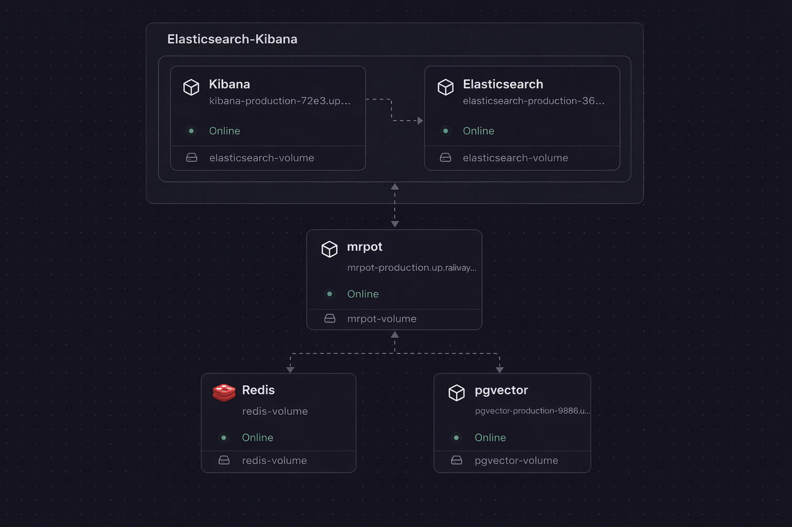

# Mr Pot

Mr Pot is a Spring Boot RAG service that streams “thinking” events while answering questions with retrieval, memory, and file-understanding context.

## Demo
Link: https://www.yuqi.site/?openChat=1


https://github.com/user-attachments/assets/4860a447-ff30-4a9d-a6a3-ede09c0b1f9e


## Service structure

This project is commonly deployed as a small set of services (e.g., on Railway or with Docker Compose):

- **mrpot (Spring Boot app)**  
  Orchestrates RAG retrieval, memory, file understanding, and SSE streaming. Connects to Postgres (pgvector), Redis, and Elasticsearch.

- **pgvector (Postgres + pgvector extension)**  
  Stores the vector table (`vector_store`) used by Spring AI PGVectorStore, and can also host JPA-managed tables (e.g., candidates/logging tables).

- **Redis**  
  Stores chat turn memory (`RedisChatMemoryService`) and any session-scoped short-lived state.

- **Elasticsearch**  
  Optional indexing layer for candidate/event analytics and fast filtering/aggregation.

- **Kibana**  
  UI for dashboards/observability against Elasticsearch.

## Project layout

- **Controllers**: `RagAnswerController` exposes blocking and SSE streaming answer endpoints, and `RagRetrievalController` exposes standalone knowledge-base search endpoints.
- **Services**: `RagAnswerService` orchestrates retrieval, memory, file understanding, prompt assembly, and logging; `RagRetrievalService` performs KB searches with configurable `topK` and `minScore` defaults.
- **Tools**: see **Tools overview** above.
- **Infra**: `RedisChatMemoryService`, `RagRunLogger`, and `LogIngestionClient` handle chat turn persistence and lightweight analytics logging.

## API endpoints

- `POST /api/rag/answer`: blocking RAG answer for a question payload.
- `POST /api/rag/answer/stream`: SSE stream of thinking stages and partial answers.
- `GET /api/rag/retrieve`: simple retrieval with query parameter `q` using default `topK/minScore`.
- `POST /api/rag/retrieve`: advanced retrieval where `topK` and `minScore` can be supplied in the body.

### SSE streaming from the command line

```bash
curl -N --http1.1 -X POST "http://localhost:8080/api/rag/answer/stream"   -H "Content-Type: application/json"   -H "Accept: text/event-stream"   -d '{
    "question": "What skills does he have?",
    "sessionId": "0002424232",
    "deepThinking": true,
    "scopeMode": "PRIVACY_SAFE",
    "fileUrls": ["https://.../Yuqi_Guo_Resume.pdf"]
  }'
```

Swagger UI is available at http://localhost:8080/swagger-ui when the app is running.

### Local development

```bash
./mvnw spring-boot:run
```

## Appendix
### Tools overview

- **KbTools**: runs vector/sparse retrieval against the knowledge base, supporting multi-query expansion and configurable `topK`/`minScore`.
- **MemoryTools**: renders recent chat turns from Redis into prompt-ready history strings with truncation.
- **FileTools**: normalizes attachment URLs, extracts text, and generates follow-up search queries from file content.
- **RoadmapPlannerTools**: creates an optional multi-step plan for deep-thinking requests.
- **ScopeGuardTools**: enforces scope/privacy boundaries before deeper reasoning starts.
- **EntityResolveTools**: resolves entities across question, files, and history to guide retrieval.
- **EvidenceRerankTools**: re-ranks KB matches with extracted terms for relevance.
- **ContextCompressTools**: compresses assembled context to fit prompt budgets while preserving key facts.
- **ConflictDetectTools**: flags contradictions between retrieved context and attachments.
- **PrivacySanitizerTools**: scrubs sensitive content from context before use.
- **CodeSearchTools**: optionally searches a local repo when `mrpot.code.root` is configured.
- **AnswerOutlineTools / AssumptionCheckTools / ActionPlanTools / TrackCorrectTools / EvidenceGapTools**: deep-thinking helpers that outline answers, check assumptions, identify gaps, keep responses on-track, and propose next steps.
